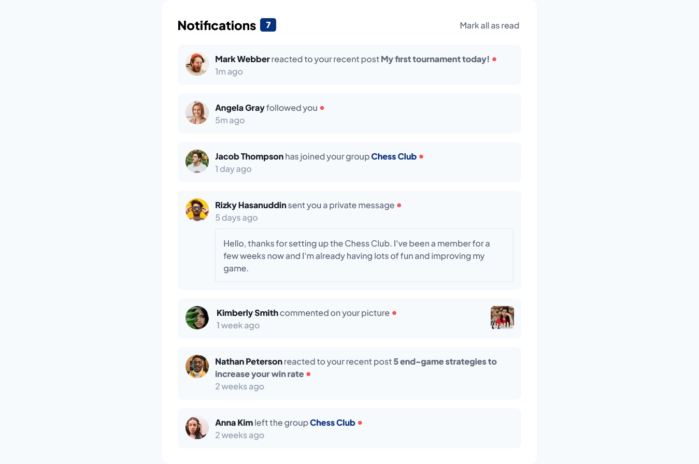

# Frontend Mentor - Notifications page solution

This is a solution to the [Notifications page challenge on Frontend Mentor](https://www.frontendmentor.io/challenges/notifications-page-DqK5QAmKbC).

## Table of contents

- [Overview](#overview)
  - [The challenge](#the-challenge)
  - [Screenshot](#screenshot)
  - [Links](#links)
- [My process](#my-process)
  - [Built with](#built-with)
  - [What I learned](#what-i-learned)
  - [Useful resources](#useful-resources)
- [Author](#author)

## Overview

### The challenge

Users should be able to:

- Distinguish between "unread" and "read" notifications
- Select "Mark all as read" to toggle the visual state of the unread notifications and set the number of unread messages to zero
- View the optimal layout for the interface depending on their device's screen size
- See hover and focus states for all interactive elements on the page

### Screenshot



### Links

- Live Site URL: [https://lucasepk.github.io/notifications-page/](https://lucasepk.github.io/notifications-page/)

## My process

### Built with

- Semantic HTML5 markup
- CSS
- Flexbox
- CSS Grid
- JavaScript
- Mobile-first workflow

### What I learned

About CSS I learnt to use variable fonts and the outline property
```css
@font-face {
  /*this imports variable font*/
	font-family: 'Plus Jakarta Sans';
	src: url('assets/fonts/PlusJakartaSans-VariableFont_wght.ttf') format('truetype-variations');
	font-weight: 500 800;
}
```

About JavaScript I learnt to use *parentElement, nextElementSibling, classList.contains(), classList.add()* and *querySelectorAll()*
```js
function mark_as_read(notification_element) { 
    //this function takes the username html element (or a previous html element to the dot) of a notification as a parameter and adds read notification style to the correct notification, then updates the number of unread notifications through the specific function
    event.preventDefault(); //this prevents the 'a' html elements from refreshing the page

    let notification = notification_element.parentElement.parentElement;

    let notification_dot;
    let next_element = notification_element.nextElementSibling;
    while (next_element) {
        if (next_element.classList.contains("js-notification-dot")) { //this checks if we found the dot notification html element
            notification_dot = next_element;
            break
        }

        next_element = next_element.nextElementSibling;
    }

    notification_dot.classList.add("notification-dot-read"); //this hides the notification dot
    notification.classList.add("notification-read"); //this removes the background color
    update_notifications_number();
}
```

### Useful resources

- [https://bobbyhadz.com/blog/javascript-find-next-element-with-class](https://bobbyhadz.com/blog/javascript-find-next-element-with-class) - this article is really useful to understand how to find a next element with a specific class in JavaScript 
- [https://www.javascripttutorial.net/javascript-dom/javascript-get-child-element/](https://www.javascripttutorial.net/javascript-dom/javascript-get-child-element/) - This article explains how to get the child of an html element in Javascript
- [https://developer.mozilla.org/en-US/docs/Web/API/Element/nextElementSibling](https://developer.mozilla.org/en-US/docs/Web/API/Element/nextElementSibling) - This page explains how to use nextElementSibling
- [https://www.digitalocean.com/community/tutorials/css-variable-fonts](https://www.digitalocean.com/community/tutorials/css-variable-fonts) - This page explains how to use variable fonts in CSS
- [https://web.dev/variable-fonts/](https://web.dev/variable-fonts/) - This explains variable fonts in depth
- [https://developer.mozilla.org/en-US/docs/Web/API/Node/parentElement](https://developer.mozilla.org/en-US/docs/Web/API/Node/parentElement) - This page explains how to use parentElement property in JS
- [https://developer.mozilla.org/en-US/docs/Web/CSS/outline](https://developer.mozilla.org/en-US/docs/Web/CSS/outline) - This page explains css outline property

## Author

- Frontend Mentor - [@LucasEPK](https://www.frontendmentor.io/profile/LucasEPK)
